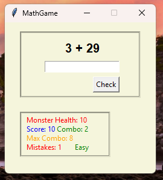
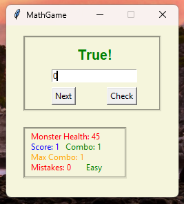

# 🧮 MathGame

## 📝 Description:

Introducing the new GUI-based MathGame! Solve random math questions to lower the Monster’s health and emerge victorious. Good luck!

## ✨ Features:

- Random addition, subtraction, multiplication, and division problems

- Health system for the monster

- Score and combo system

- 3 Difficulty options

- Simple GUI made with Tkinter

- Shows the correct answer after the wrong answer

- Division operations are only performed with integers

- Includes error handling to ensure only numbers are entered

## 🎮 How to Play:

- Run the program: `MathGameGUI.pyw`

- Solve the math problems presented

- Reduce the monster's health to 0 to win

Have fun!

## 📸 Screenshot

## 🤝 Contributors:
Thanks to everyone who contributed to this project!

## 👤 Author

by wwohyzzh